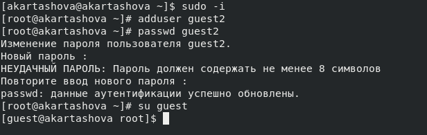
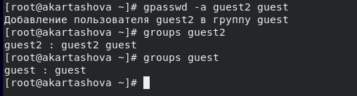
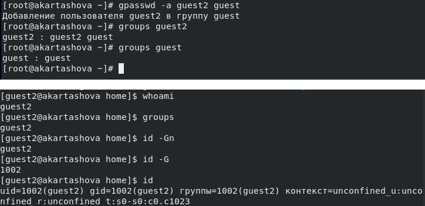
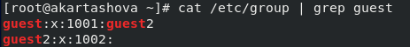
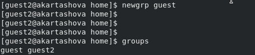
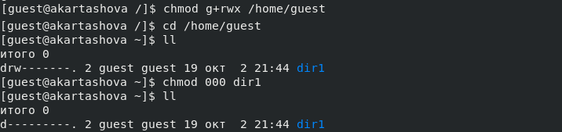

---
## Front matter
lang: ru-RU
title: "Отчет по лабораторной работе №3: Дискреционное разграничение прав в Linux. Два пользователя"
subtitle: "*дисциплина: Информационная безопасность*"
author: "Каташова Алиса, НФИбд-03-18"

## Formatting
toc: false
slide_level: 2
theme: metropolis
mainfont: PT Serif
romanfont: PT Serif
sansfont: PT Sans
monofont: PT Mono
mainfontoptions: Ligatures=TeX
romanfontoptions: Ligatures=TeX
sansfontoptions: Ligatures=TeX,Scale=MatchLowercase
monofontoptions: Scale=MatchLowercase
header-includes:
 - \metroset{progressbar=frametitle,sectionpage=progressbar,numbering=fraction}
 - '\makeatletter'
 - '\beamer@ignorenonframefalse'
 - '\makeatother'
aspectratio: 43
section-titles: true

---


## Цель работы

**Цель:**

Получение практических навыков работы в консоли с атрибутами файлов для групп пользователей


# Последовательность выполнения лабораторной работы

## Создание учетной записи
 Создадим учетную запись пользователя guest2  и зададим ей пароль с помощью команды adduser. После войдем в учетную запись от имени этого пользователя и от имени пользователя guest во втором терминале

{ #fig:001 width=70% }

## Добавление пользователя в группу

**Команды:**

```bash
gpasswd -a guest2 guest
groups
```
{ #fig:002 width=70% }


## Проверка групп пользователей

**Команды:**

```bash
groups guest
groups guest2
id -Gn
id -G
```
{ #fig:003 width=70% }

## Файл /etc/group

{ #fig:004 width=70% }

## Регистрация пользователя guest2 в группе guest

**Команда:**

```bash
newgrp guest
```

{ #fig:005 width=70% }

## Изменение прав директории /home/guest и снятие атрибутов

{ #fig:006 width=70% }


## Минимальные права


| Операция		|Минимальнве права на директорию|Минимальные права на файл|
| ---------------------	|-------------------------------|-------------------------|
| Создание файла	|		d-wx------- (300)		|		(000)|
| Удаление файла	|				d-wx------- (300)	|	 (000)|
| Чтение файла		|				d-wx------- (100)	|			 -r-------- (400) |
| Запись в файл		|				d-wx------- (100)	|			 --w------- (200) |
| Переименование файла	|			d-wx------- (300)		|	(000)|
| Создание поддиректории|				d-wx------- (300)	|	(000)|
| Удаление поддиректории|				d-wx------- (300)	|	(000)|


# Выводы


Мы получили практические навыки работы в консоли с атрибутами файлов для групп пользователей
