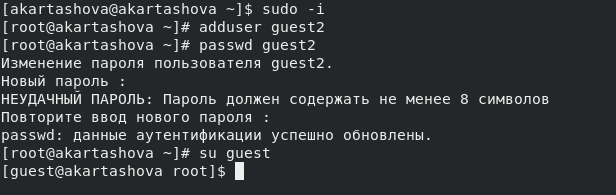
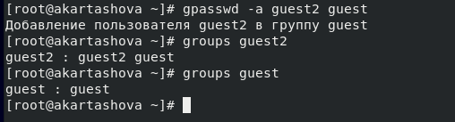
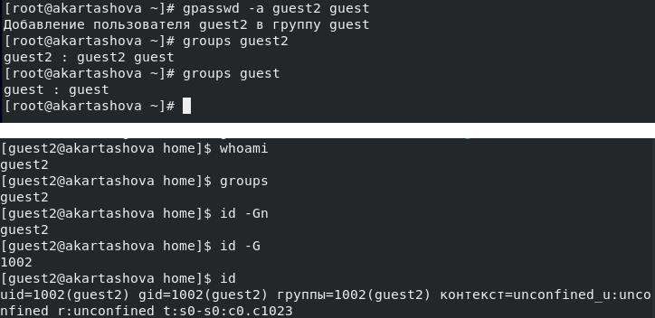

---
# Front matter
lang: ru-RU
title: "Отчет по лабораторной работе №3"
subtitle: "Дискреционное разграничение прав в Linux. Два пользователя"
author: "Карташова Алиса Семеновна"

# Formatting
toc-title: "Содержание"
toc: true # Table of contents
toc_depth: 2
lof: true # List of figures
lot: true # List of tables
fontsize: 12pt
linestretch: 1.5
papersize: a4paper
documentclass: scrreprt
polyglossia-lang: russian
polyglossia-otherlangs: english
mainfont: PT Serif
romanfont: PT Serif
sansfont: PT Sans
monofont: PT Mono
mainfontoptions: Ligatures=TeX
romanfontoptions: Ligatures=TeX
sansfontoptions: Ligatures=TeX,Scale=MatchLowercase
monofontoptions: Scale=MatchLowercase
indent: true
pdf-engine: lualatex
header-includes:
  - \linepenalty=10 # the penalty added to the badness of each line within a paragraph (no associated penalty node) Increasing the value makes tex try to have fewer lines in the paragraph.
  - \interlinepenalty=0 # value of the penalty (node) added after each line of a paragraph.
  - \hyphenpenalty=50 # the penalty for line breaking at an automatically inserted hyphen
  - \exhyphenpenalty=50 # the penalty for line breaking at an explicit hyphen
  - \binoppenalty=700 # the penalty for breaking a line at a binary operator
  - \relpenalty=500 # the penalty for breaking a line at a relation
  - \clubpenalty=150 # extra penalty for breaking after first line of a paragraph
  - \widowpenalty=150 # extra penalty for breaking before last line of a paragraph
  - \displaywidowpenalty=50 # extra penalty for breaking before last line before a display math
  - \brokenpenalty=100 # extra penalty for page breaking after a hyphenated line
  - \predisplaypenalty=10000 # penalty for breaking before a display
  - \postdisplaypenalty=0 # penalty for breaking after a display
  - \floatingpenalty = 20000 # penalty for splitting an insertion (can only be split footnote in standard LaTeX)
  - \raggedbottom # or \flushbottom
  - \usepackage{float} # keep figures where there are in the text
  - \floatplacement{figure}{H} # keep figures where there are in the text
---

# Цель работы

Получение практических навыков работы в консоли с атрибутами файлов для групп пользователей

# Выполнение лабораторной работы
1. Создадим вторую учетную запись пользователя guest2  и зададим ей пароль с помощью команды adduser. После войдем в обе учетные  записи с разных консолей (рис. -@fig:001)

**Команды:**

```bash
adduser guest
```
{ #fig:001 width=70% }

2. Добавим пользователя guest2 в группу пользователя guest. Проверим, добавился ли пользователь в группу(рис. -@fig:002)

**Команды:**

```bash
gpasswd -a guest2 guest
groups
```

{ #fig:002 width=70% }

3. Для обоих пользователей командой pwd определим директорию, в которой находимся.Сравним полученную информацию ос приглашениями командной строки.

После перехода к пользователю gust из sudo-пользователя мы оказались в директории root, командой cd ./ вернулись в домашнюю директорию пользователя

4. Уточним имя вашего пользователя, его группу, кто входит в неё и к каким группам принадлежит он сам. Определим командами groups guest и groups guest2, в какие группы входят пользователи guest и guest2. Сравним вывод команды groups с выводом команд id -Gn и id -G.(рис. -@fig:003)


**Команды:**

```bash
groups guest
groups guest2
id -Gn
id -G
```

{ #fig:003 width=70% }

5. Сравним полученную информацию с содержимым файла /etc/group.(рис. -@fig:004). Видим, что в группе guest есть пользователь guest2

**Команда:**

```bash
cat /etc/group

```
{ #fig:004 width=70% }

6. От имени пользователя guest2 выполним регистрацию пользователя guest2 в группе guest(рис. -@fig:005). Проверим что списке груп пользователя появилась группа guest

**Команда:**

```bash
newgrp guest
```

{ #fig:005 width=70% }

7. От имени пользователя guest измените права директории /home/guest,разрешив все действия для пользователей группы и снимите с директории /home/guest/dir1 все атрибуты,проверив правильность снятия атрибута (рис. -@fig:006)

**Команды:**

```bash

chmod g+rwx /home/guest
chmod 000 dirl


```

{ #fig:006 width=70% }


10. Меняя атрибуты у директории dir1 и файла file1 от имени пользователя guest и делая проверку от пользователя guest2, заполним табл."Установленные права и разрешенные действия", определив опытным путём, какие операции разрешены, а какие нет.


| Права директории    | Права файла|  1| 2| 3| 4| 5|  6|  7|  8|
| ------------------- |------------|--------------|---------------|--------------|--------------|----------------|----------------------------|--------------------|---------------------|
| (000)(---)	      |	(000)(---) | -            | -		  |-		 |-		|-		 |-			      |	-		   |-			 |
| (010)(--x)          | (000)(---) | -            | -		  |-		 |-		|+		 |-			      |	-		   |+			 |    
| (020)(-w-)          | (000)(---) | +            | +		  |-		 |-		|-		 |-			      |	-		   |-			 |
| (030)(-wx)          | (000)(---) | +            | +		  |-		 |-		|+		 |-			      |	-		   |-			 |
| (040)(r--)          | (000)(---) | -            | -		  |-		 |-		|-		 |+			      |	-		   |-			 |
| (050)(r-x)          | (000)(---) | -            | -		  |-		 |-		|+		 |+			      |	-		   |-			 |
| (060)(rw-)          | (000)(---) | +            | +		  |-		 |-		|-		 |+			      |	-		   |-			 |
| (070)(rwx)          | (000)(---) | +            | +		  |-		 |-		|+		 |+			      |	-		   |-			 |
| (000)(---)	      |	(010)(--x) | -            | -		  |-		 |-		|-		 |-			      |	-		   |-			 |
| (010)(--x)          | (010)(--x) | -            | -		  |-		 |-		|-		 |+		      |	-		   |-			 |
| (020)(-w-)          | (010)(--x) | +            | +		  |-		 |-		|-		 |-			      |	-		   |-			 |
| (030)(-wx)          | (010)(--x) | +            | +		  |-		 |-		|-		 |+			      |	-		   |-			 |
| (040)(r--)          | (010)(--x) | -            | -		  |-		 |-		|-		 |-			      |	+		   |-			 |
| (050)(r-x)          | (010)(--x) | -            | -		  |-		 |-		|-		 |+			      |	+		   |-			 |
| (060)(rw-)          | (010)(--x) | +            | +		  |-		 |-		|-		 |-			      |	+		   |-			 |
| (070)(rwx)          | (010)(--x) | +            | +		  |-		 |-		|-		 |+			      |	+		   |+			 |
| (000)(---)	        |	(020)(-w-) | -            | -		  |+		 |-		|-		 |-			      |	+		   |-		 |
| (010)(--x)          | (020)(-w-) | -            | -		  |+		 |-		|+		 |-			      |	+		   |-			 |
| (020)(-w-)          | (020)(-w-) | +           | +		  |+		 |-		|-		 |-			      |	+		   |-			 |
| (030)(-wx)          | (020)(-w-) | +            | +		  |+		 |-		|+		 |-			      |	+		   |-			 |
| (040)(r--)          | (020)(-w-) | -            | -		  |+		 |-		|-		 |+			      |	+		   |-			 |
| (050)(r-x)          | (020)(-w-) | -            | -		  |+		 |-		|+		 |+			      |	+		   |-			 |
| (060)(rw-)          | (020)(-w-) | +            | +		  |+		 |-		|-		 |+			      |	+		   |-			 |
| (070)(rwx)          | (020)(-w-) | +            | +		  |+		 |-		|+		 |+			      |	+		   |-			 |
| (000)(---)	        |	(300)(-wx) | -            | -		  |+	   |-		|-		 |-			      |	+		   |-			 |
| (010)(--x)          | (300)(-wx) | -            | -		  |+		 |-		|+		 |-			      |	+		   |-			 |
| (020)(-w-)          | (300)(-wx) | +            | +		  |+		 |-		|-		 |-			      |	+		   |-			 |
| (030)(-wx)          | (300)(-wx) | +            | +		  |+		 |-		|+		 |-			      |	+		   |-			 |
| (040)(r--)          | (300)(-wx) | -            | -		  |+		 |-		|-		 |+			      |	+		   |-			 |
| (050)(r-x)          | (300)(-wx) | -            | -		  |+		 |-		|+		 |+			      |	+		   |-			 |
| (060)(rw-)          | (300)(-wx) | +            | +		  |+		 |-		|-		 |+			      |	+		   |-			 |
| (070)(rwx)          | (300)(-wx) | +            | +		  |+		 |-		|+		 |+			      |	+		   |-			 |
| (000)(---)	        |	(400)(r--) | -            | -		  |-		 |+		|-		 |-			      |	-		   |-			 |
| (010)(--x)          | (400)(r--) | -            | -		  |-		 |+		|+		 |-			      |	-		   |-			 |    
| (020)(-w-)          | (400)(r--) | +            | +		  |-		 |+		|-		 |-			      |	-		   |-			 |
| (030)(-wx)          | (400)(r--) | +            | +		  |-		 |+		|+		 |-			      |	-		   |-			 |
| (040)(r--)          | (400)(r--) | -            | -		  |-		 |+		|-		 |+			      |	-		   |-			 |
| (050)(r-x)          | (400)(r--) | -            | -		  |-		 |+		|+		 |+			      |	-		   |-			 |
| (050)(rw-)          | (400)(r--) | +            | +		  |-		 |+		|-		 |+			      |	-		   |-			 |
| (070)(rwx)          | (400)(r--) | +            | +		  |-		 |+		|+		 |+			      |	-		   |-			 |
| (000)(---)	        |	(500)(r-x) | -            | -		  |-		 |+		|-		 |-			      |	-		   |-			 |
| (010)(--x)          | (500)(r-x) | -            | -		  |-		 |+		|+		 |-			      |	-		   |-			 |
| (020)(-w-)          | (500)(r-x) | +            | +		  |-		 |+		|-		 |-			      |	-		   |-			 |
| (030)(-wx)          | (500)(r-x) | +            | +		  |-		 |+		|+		 |-			      |	-		   |-			 |
| (040)(r--)          | (500)(r-x) | -            | -		  |-		 |+		|-		 |+			      |	-		   |-			 |
| (050)(r-x)          | (500)(r-x) | -            | -		  |-		 |+		|+		 |+			      |	-		   |-			 |
| (060)(rw-)          | (500)(r-x) | +            | +		  |-		 |+		|-		 |+			      |	-		   |-			 |
| (070)(rwx)          | (500)(r-x) | +            | +		  |-		 |+		|+		 |+			      |	-		   |-			 |
| (000)(---)	        |	(600)(rw-) | -            | -		  |-		 |+		|-		 |-			      |	+		   |-			 |
| (010)(--x)          | (600)(rw-) | -            | -		  |-		 |+		|+		 |-			      |	+		   |-			 |
| (020)(-w-)          | (600)(rw-) | +            | +		  |-		 |+		|-		 |-			      |	+		   |-			 |
| (030)(-wx)          | (600)(rw-) | +            | +		  |-		 |+		|+		 |-			      |	+		   |-			 |
| (040)(r--)          | (600)(rw-) | -            | -		  |-		 |+		|-		 |+			      |	+		   |-			 |
| (050)(r-x)          | (600)(rw-) | -            | -		  |-		 |+		|+		 |+			      |	+		   |-			 |
| (060)(rw-)          | (600)(rw-) | +            | +		  |-		 |+		|-		 |+			      |	+		   |-			 |
| (070)(rwx)          | (600)(rw-) | +            | +		  |-		 |+		|+		 |+			      |	+		   |-			 |
| (000)(---)	       |	(700)(rwx) | -            | -		  |-		 |+		|-		 |-			      |	+		   |-			 |
| (010)(--x)          | (700)(rwx) | -            | -		  |-		 |+		|+		 |-			      |	+		   |-			 |
| (020)(-w-)          | (700)(rwx) | +            | +		  |-		 |+		|-		 |-			      |	+		   |-			 |
| (030)(-wx)          | (700)(rwx) | +            | +		  |-		 |+		|+		 |-			      |	+		   |-			 |
| (040)(r--)          | (700)(rwx) | -            | -		  |-		 |+		|-		 |+			      |	+		   |-			 |
| (050)(r-x)          | (700)(rwx) | -            | -		  |-		 |+		|+		 |+			      |	+		   |-			 |
| (060)(rw-)          | (700)(rwx) | +            | +		  |-		 |+		|-		 |			      |	+		   |-			 |
| (070)(rwx)          | (700)(rwx) | +            | +		  |+		 |+		|+		 |+			      |	+		   |-			 |


Сравнм данную таблицу с  табл. 2.1 (из лабораторной работы № 2). Они совпадают по всем столбцам,кроме последнего: "Смена атрибутов файла"


11. На основании заполненной таблицы определим те или иные минимально необходимые права для выполнения операций внутри директори


| Операция		|Минимальнве права на директорию|Минимальные права на файл|
| ---------------------	|-------------------------------|-------------------------|
| Создание файла	|		d-wx------- (300)		|		(000)|
| Удаление файла	|				d-wx------- (300)	|	 (000)|
| Чтение файла		|				d-wx------- (100)	|			 -r-------- (400) |
| Запись в файл		|				d-wx------- (100)	|			 --w------- (200) |
| Переименование файла	|			d-wx------- (300)		|	(000)|
| Создание поддиректории|				d-wx------- (300)	|	(000)|
| Удаление поддиректории|				d-wx------- (300)	|	(000)|


# Выводы

Мы получили практические навыки работы в консоли с атрибутами файлов для групп пользователей
